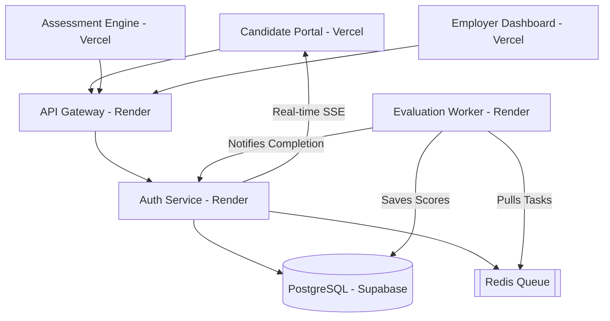

# 🚀 DistriEval: Distributed Candidate Evaluation System

A state-of-the-art, decentralized candidate evaluation platform built for high reliability and scale.

## 📖 Architecture Documentation
For a deep dive into the system's design and engineering decisions, see the **[docs/](file:///c:/Users/Mahalakshmi/Desktop/zetheta/docs/)** folder:
- **[Initial Plan & Roadmap](file:///c:/Users/Mahalakshmi/Desktop/zetheta/docs/plan.md)**
- **[Database & Schema Design](file:///c:/Users/Mahalakshmi/Desktop/zetheta/docs/schema_design.md)**
- **[API Gateway & Service Design](file:///c:/Users/Mahalakshmi/Desktop/zetheta/docs/api_design.md)**
- **[Reliable Async Pipeline](file:///c:/Users/Mahalakshmi/Desktop/zetheta/docs/pipeline_design.md)**
- **[Secure Token Handshake](file:///c:/Users/Mahalakshmi/Desktop/zetheta/docs/token_design.md)**

## 🛡️ Performance & Reliability
- **Fault Tolerance**: Redis-based async pipeline with **Queue-based** (LPUSH/BLPOP) recovery to ensure zero message loss.
- **Idempotency**: Retry-safe scoring logic using **PostgreSQL Upserts** to maintain data integrity under high load.
- **Low Latency**: Real-time evaluation updates via **Server-Sent Events (SSE)** for near-instant user feedback.
- **Optimized Retrieval**: Optimized Prisma **Database Indexing** on all hot query paths (Candidate status, createdAt).
- **Scalability**: Decoupled microservices architecture designed to run on independent clusters.

## 🗺️ System Architecture



## 🌐 Live Deployment Links

| Component | URL |
| :--- | :--- |
| **Candidate Portal** | [candidate-lime.vercel.app](https://candidate-lime.vercel.app/) |
| **Employer Dashboard** | [employer-dashboard-zetheta.vercel.app](https://employer-dashboard-zetheta.vercel.app/) |
| **Assessment Engine** | [assessment-engine-zetheta.vercel.app](https://assessment-engine-zetheta.vercel.app/) |
| **API Gateway** | [api-gateway-o9g9.onrender.com](https://api-gateway-o9g9.onrender.com) |
| **Auth Service** | [distributed-cand-eval-sys.onrender.com](https://distributed-cand-eval-sys.onrender.com) |

## 🛠️ Tech Stack

- **Frontend**: Next.js 15 (App Router), Tailwind CSS, Framer Motion, Recharts.
- **Backend**: Node.js, Express.js (API Gateway & Microservices).
- **Persistence**: PostgreSQL (Supabase) with Prisma ORM.
- **Messaging**: Redis (Reliable Queue using LPUSH/BLPOP).
- **Communication**: JWT (Secure Auth), SSE (Server-Sent Events for real-time scores).
- **Deployment**: Vercel (Frontends), Render (Backends), Supabase (Database).

## ✨ Key Technical Features

### 🔑 1. Cross-App Token Handshake
Transitions from the Candidate Portal to the Assessment Engine are secured via a **Single-Use Token**. 
- The Auth Service generates a token with a unique `nonce`.
- The `nonce` is validated against Redis and deleted instantly upon entry.
- This prevents link sharing and ensures each session is unique and time-bound.

### 📥 2. Reliable Async Evaluation Pipeline
We upgraded from Pub/Sub to a **Redis Queue (LPUSH/BLPOP)**.
- **Durability**: If the worker restarts or goes offline, submissions stay safe in the queue.
- **Zero Loss**: Every candidate's attempt is guaranteed to be processed.
- **Efficiency**: The worker pulls tasks only when it's ready, preventing service overload.

### ⚡ 3. Real-time SSE Updates
The system uses **Server-Sent Events (SSE)** to provide an "instant" feel.
- Once the worker finishes scoring, it notifies the Auth Service.
- The Auth Service pushes the score directly to the candidate's browser.
- No polling or page refreshing is required to see results.

### 📊 4. Employer Performance Monitoring
 Recruiters can monitor candidate status in real-time. Features include:
- **Expandable History**: View all previous attempts for a candidate in one click.
- **Idempotent Scoring**: Ensures that even if a message is processed twice, the candidate's data remains consistent.

## 🏃 Local Development

### Prerequisites
- Docker & Docker Compose
- Node.js 20+

### Setup
1. **Infrastructure**: Start the database, redis, and backend services.
   ```bash
   docker compose up --build
   ```
2. **Portals**: Start each frontend app.
   ```bash
   cd apps/candidate-portal && npm run dev
   ```

---
*Developed with a focus on enterprise-grade reliability, real-time observability, and premium user experience.*
