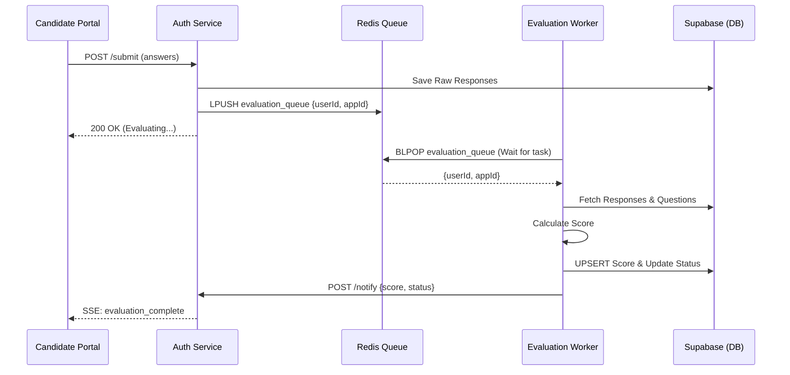

# Async Evaluation Pipeline

The evaluation pipeline is the core "Engine" of the system, designed for high reliability and massive scale.

## 🔄 The Submission Flow

## 🛡️ Reliability & Fault Tolerance

### 1. Redis Queue (LPUSH/BLPOP)
We moved from a "Fire-and-Forget" Pub/Sub model to a **Durable Queue**.
- **Scenario**: If the Worker service restarts on Render, the messages stay safely in Redis.
- **Scenario**: If there is a massive burst of 1,000 candidates submitting at once, the Worker processes them sequentially at its own pace without crashing the Auth Service.

### 2. Idempotent Upserts
The worker uses `prisma.score.upsert`. 
- **Benefit**: Even if a network error causes a message to be processed twice, the second attempt will simply update the existing score rather than creating a duplicate entry or throwing an error.

### 3. Graceful Error Handling
If a specific evaluation fails (e.g., malformed data), the worker catches the error, logs it with context, and continues to the next item in the queue.
